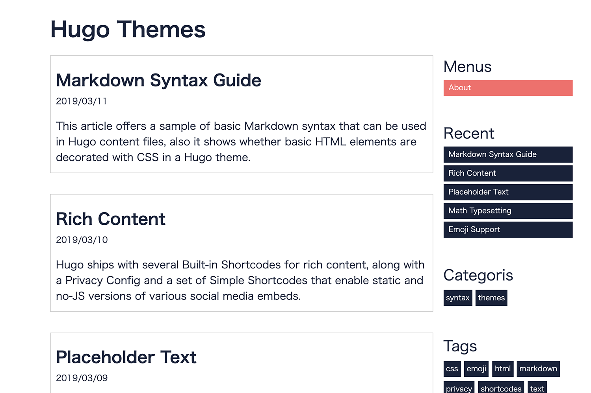
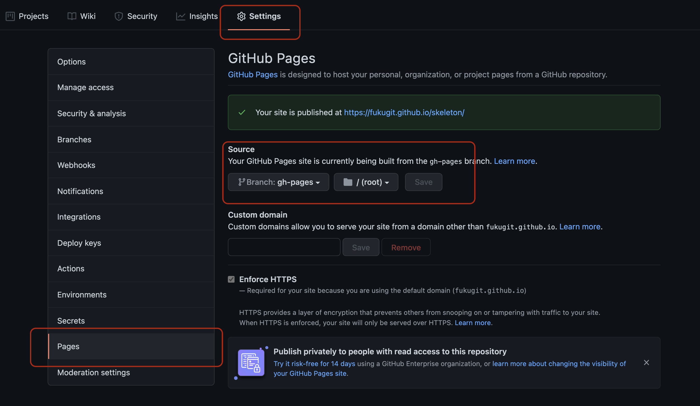

# skeleton
[](https://github.com/fukugit/skeleton/actions)
[](https://github.com/fukugit/skeleton/blob/main/LICENSE)
[](https://github.com/fukugit/skeleton/commits)
[](https://gitmoji.dev)

Skeleton is a surprisingly concise theme for Hugo, which is a [demo](https://fukugit.github.io/skeleton/).  

## Showcase


## Features
Skelton consists of tiny resources, providing the following essential features;

- Responsive design
- Widgetized sidebar
- LESS size within 500 lines
- Just four colors in the theme
- No JavaScript

Skeleton's simple structure allows for easy customization of your preferences using a fork.  

## Prerequisite
Hugo ver 0.111.2  

## Install
```
cd themes ## If lack of the directory, create it.
git submodule add https://github.com/fukugit/skeleton.git
```

### Setting of config file
Open 'config.toml' in the base of the Hugo site and set like below.  
```
theme = "skeleton"
```

## Deploy
To run your Hugo with Skeleton, execute the following command.  
```
hugo server
```

## Update
If this project is updated while using it in your Hugo blog, you can run the below command to update the latest version.  

### Update Skeleton
```
git submodule update --recursive
```

## Uninstallation
If you want to uninstall Skeleton, you can remove it following the below commands.  

### Uninstall Skeleton
```
## Move your current directory before executing the below commands.
git submodule deinit -f themes/skeleton
git rm -f themes/skeleton
rm -rf .git/modules/themes/skeleton
```

## GitHub Actions
The [demo page](https://fukugit.github.io/skeleton/) in this page got deployed using GitHub Actions. You can see the GitHub Actions setting file [here](./.github/workflows/github-pages.yml). The following is the setting of GitHub Actions and GitHub Pages on GitHub.  
1. Creat directory that is ```.github/workflows```. If already existing, skip it.  
1. Copy [github-pages.yml](./.github/workflows/github-pages.yml) into the ```.github/workflows``` directory.  
1. Set GitHub page like the below.  

1. To build the page with the above GitHub Actions, push something at the main branch.  
